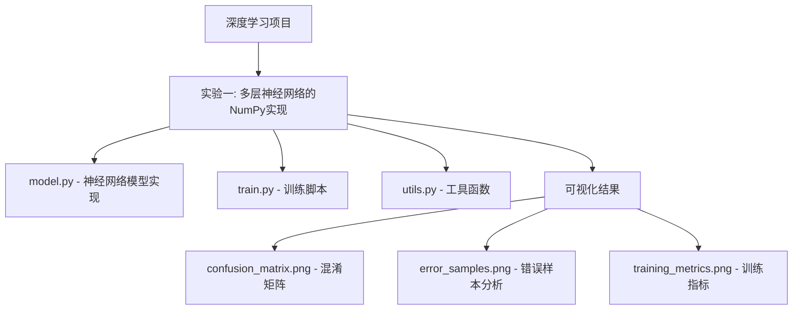
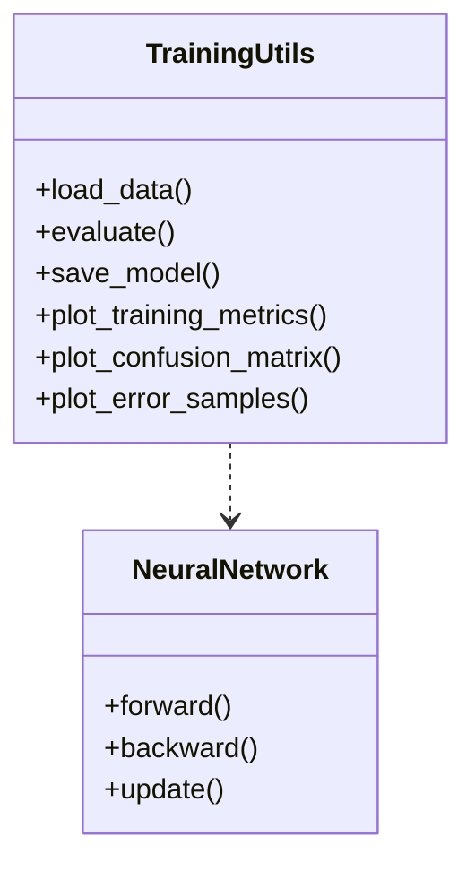

# 深度学习实验项目 🧠

这个仓库包含了深度学习相关的实验项目实现，主要聚焦于使用NumPy从零开始实现深度学习算法。

## 项目结构 📁



## 实验一：多层神经网络的NumPy实现 🔬

### 项目概述
这个实验展示了如何使用NumPy从零开始实现一个多层神经网络，用于解决MNIST手写数字分类问题。

### 主要特点 ✨
- 🔧 纯NumPy实现，不依赖深度学习框架
- 📊 完整的可视化支持（训练过程、混淆矩阵、错误样本分析）
- 🎯 模块化设计，代码结构清晰
- 📈 包含详细的实验分析和结果展示

### 代码结构


### 环境要求 🛠️
- Python 3.6+
- NumPy
- Matplotlib
- Seaborn
- Scikit-learn

### 使用说明 📝
1. 克隆仓库
```bash
git clone git@github.com:Alleyf/DeepLearning.git

cd DeepLearning
```

2. 安装依赖
```bash
# 方法1：直接从requirements.txt安装所有依赖
pip install -r requirements.txt

# 方法2：手动安装各个依赖包
pip install numpy matplotlib seaborn scikit-learn
```

3. 运行实验
```bash
cd "experiment_one_numpy implementation of multi-layer neural network"
python train.py
```

### 实验结果 📊

实验过程会生成以下可视化结果：
- training_metrics.png：展示训练过程中的损失和准确率变化
- confusion_matrix.png：展示模型在测试集上的混淆矩阵
- error_samples.png：展示模型预测错误的样本示例

## 许可证 📄
本项目基于 APACHE 2.0 许可证开源。

## 贡献指南 🤝
欢迎提交 Issue 和 Pull Request 来帮助改进项目！

## 贡献者名单 🧑💻
<a href="https://github.com/Alleyf/DeepLearning/graphs/contributors">
  
</a>