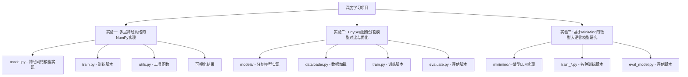

<div align="center">
  
  
  
</div>
<div align="center">


</div>


# 深度学习实验项目 🧠


> [!TIP]
> 这个仓库包含了三个深度学习相关的实验项目实现，涵盖神经网络基础实现、图像分割模型优化和微调微型大语言模型。


## 项目结构 📁



## 实验一：多层神经网络的NumPy实现 🔬

### 项目概述
这个实验展示了如何使用NumPy从零开始实现一个多层神经网络，用于解决MNIST手写数字分类问题。

## 实验二：TinySeg图像分割模型对比与优化研究 🖼️

### 项目概述
本实验对比研究了PSPNet、DeepLabV3和CCNet三种图像分割模型，通过优化训练策略和模型结构提升分割性能。

## 实验三：基于MiniMind的微型大语言模型研究 💬

### 项目概述
本项目从零开始实现了一个仅25.8M参数的微型大语言模型MiniMind，包含预训练、微调、LoRA、DPO强化学习和模型蒸馏等完整流程。

## 主要特点 ✨

**实验一**
- 🔧 纯NumPy实现，不依赖深度学习框架
- 📊 完整的可视化支持（训练过程、混淆矩阵、错误样本分析）
- 🎯 模块化设计，代码结构清晰

**实验二**
- 🔍 三种主流分割模型的对比研究
- ⚡ 训练策略和模型结构的优化方案
- 📈 详细的性能评估和分析

**实验三**
- 💡 从零实现25.8M参数的微型LLM
- 🚀 包含预训练、SFT、LoRA、DPO全流程
- ⏱️ 低成本训练（3元+2小时）
- 🧩 兼容主流框架(transformers/trl/peft)

## 环境要求 🛠️
- Python 3.9+
- NumPy
- Matplotlib
- Seaborn
- Scikit-learn
- torch
- transformers
- ...

## 使用说明 📝
1. 克隆仓库
```bash
git clone git@github.com:Alleyf/DeepLearning.git

cd DeepLearning
```

2. 安装依赖
```bash
# 方法1：直接从requirements.txt安装所有依赖
pip install -r requirements.txt
```

3. 运行实验
```bash
cd "experiment_one_numpy implementation of multi-layer neural network"
python train.py
```

## 许可证 📄
本项目基于 APACHE 2.0 许可证开源。

## 贡献指南 🤝
欢迎提交 Issue 和 Pull Request 来帮助改进项目！

## 贡献者名单 🧑💻
<a href="https://github.com/Alleyf/DeepLearning/graphs/contributors">
  
</a>

## Star History

<picture>
    <source media="(prefers-color-scheme: dark)" srcset="https://api.star-history.com/svg?repos=Alleyf/DeepLearning&type=Date&theme=dark" />
    <source media="(prefers-color-scheme: light)" srcset="https://api.star-history.com/svg?repos=Alleyf/DeepLearning&type=Date" />
    
</picture>