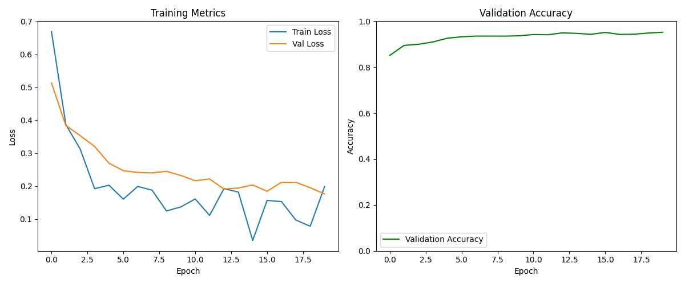
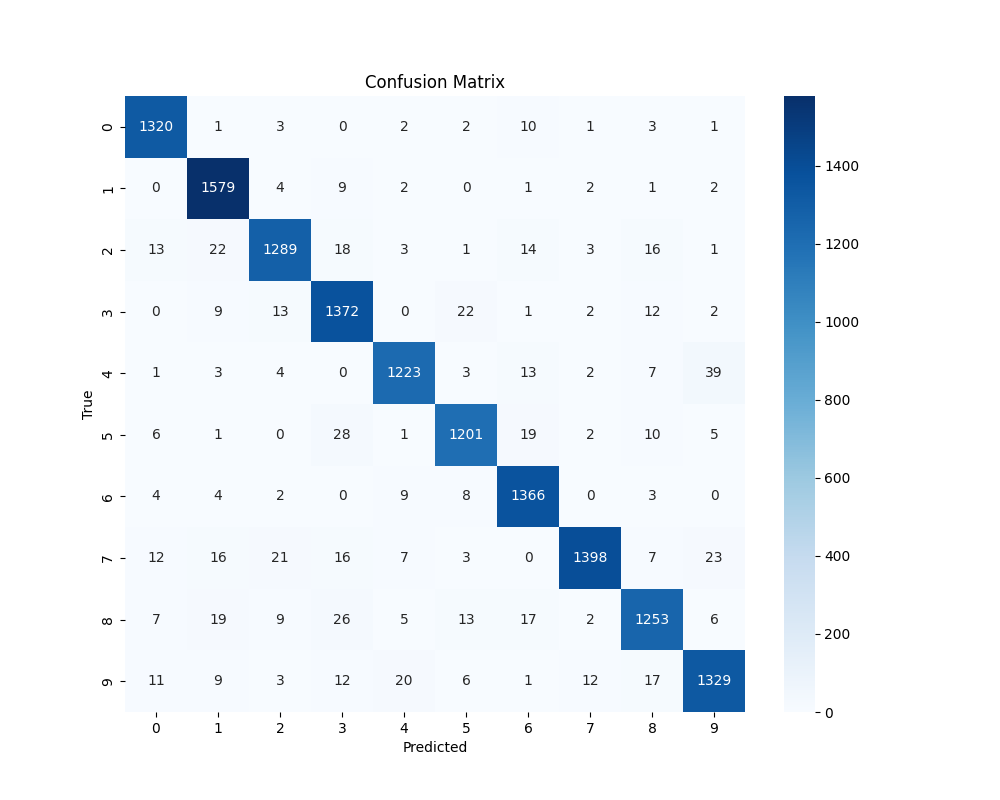
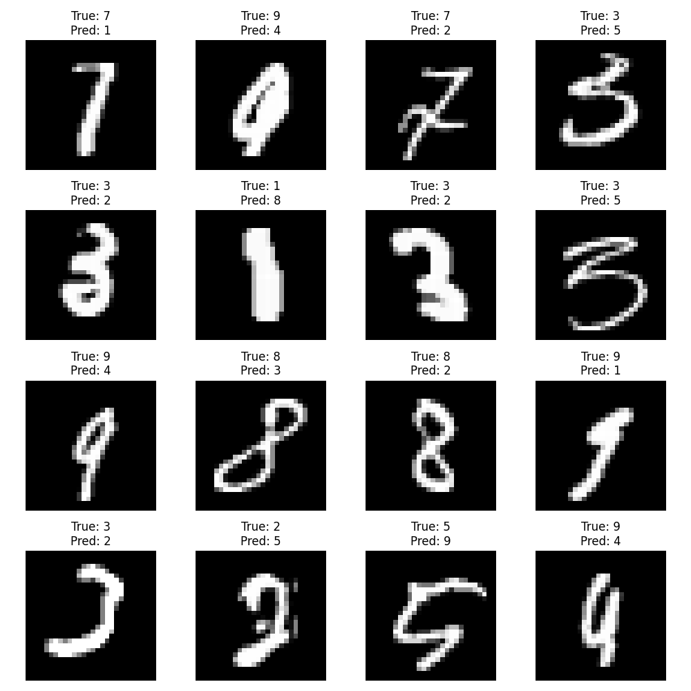
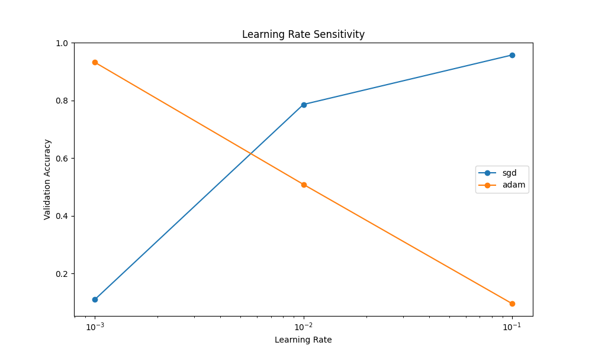

# 基于NumPy实现多层神经网络的MNIST手写数字分类实验报告

## 1. 实验背景与目标

### 1.1 实验背景
手写数字识别是深度学习领域的一个经典问题，也是验证神经网络算法有效性的重要基准任务。本实验通过使用NumPy从零开始实现一个多层神经网络，来解决MNIST手写数字分类问题，旨在深入理解神经网络的基本原理和实现细节。

### 1.2 实验目标
- 使用NumPy实现一个完整的多层神经网络
- 实现前向传播、反向传播和参数更新等核心算法
- 实现多种优化技术，包括Dropout正则化和Adam优化器
- 通过可视化分析训练过程和实验结果
- 进行超参数敏感性分析实验

## 2. 理论基础

### 2.1 神经网络结构
本实验实现的是一个四层神经网络，包含三个隐藏层和一个输出层：
- 输入层：784个神经元（对应28×28像素的输入图像）
- 隐藏层1：512个神经元 + ReLU激活 + Dropout(0.3)
- 隐藏层2：256个神经元 + ReLU激活 + Dropout(0.3)
- 隐藏层3：128个神经元 + ReLU激活 + Dropout(0.3)
- 输出层：10个神经元 + Softmax激活

### 2.2 核心算法

#### 2.2.1 前向传播
每一层的前向传播计算：
```python
Z = X @ W + b  # 线性变换
A = activation(Z)  # 非线性激活
```

#### 2.2.2 反向传播
基于链式法则计算梯度：
```python
dZ = dA * activation_derivative(Z)
dW = X.T @ dZ
db = np.sum(dZ, axis=0)
dX = dZ @ W.T
```

#### 2.2.3 Adam优化器
实现了Adam优化器进行参数更新：
```python
m = beta1 * m + (1 - beta1) * gradient
v = beta2 * v + (1 - beta2) * gradient**2
m_hat = m / (1 - beta1**t)
v_hat = v / (1 - beta2**t)
params -= learning_rate * m_hat / (sqrt(v_hat) + epsilon)
```

## 3. 代码实现

### 3.1 模块化设计
项目采用模块化设计，主要包含以下组件：
- model.py：实现神经网络层和损失函数
- train.py：实现训练和评估流程
- utils.py：实现数据处理和可视化功能

### 3.2 关键代码实现

#### 3.2.1 神经网络层实现
```python
class Layer:
    def __init__(self, input_dim, output_dim, activation='relu', dropout_rate=0):
        self.W = np.random.randn(input_dim, output_dim) * 0.01
        self.b = np.zeros(output_dim)
        self.activation = activation
        self.dropout_rate = dropout_rate

    def forward(self, X):
        self.X = X
        self.Z = X @ self.W + self.b
        self.A = self.activate(self.Z)
        if self.dropout_rate > 0:
            self.mask = np.random.binomial(1, 1-self.dropout_rate, self.A.shape)
            self.A *= self.mask / (1-self.dropout_rate)
        return self.A
```

#### 3.2.2 损失函数实现
```python
def cross_entropy_loss(y_pred, y_true, reg_lambda, layers):
    m = y_true.shape[0]
    loss = -np.sum(y_true * np.log(y_pred + 1e-8)) / m
    
    # L2正则化
    l2_reg = 0
    for layer in layers:
        l2_reg += np.sum(layer.W ** 2)
    loss += 0.5 * reg_lambda * l2_reg
    
    return loss
```

## 4. 实验过程

### 4.1 数据预处理
- 从OpenML加载MNIST数据集
- 将像素值归一化到[0,1]范围
- 对标签进行One-hot编码
- 划分训练集和验证集（8:2）

### 4.2 训练配置
主要超参数设置：
- 批量大小：128
- 学习率：0.001
- L2正则化系数：0.0005
- Dropout率：0.3
- 训练轮数：20
- Adam优化器参数：β1=0.9，β2=0.999

### 4.3 训练过程
训练过程包含以下步骤：
1. 小批量梯度下降
2. 前向传播计算预测值
3. 计算交叉熵损失（含L2正则化）
4. 反向传播更新权重
5. 每轮结束后在验证集上评估
6. 保存最佳模型参数

## 5. 实验结果分析

### 5.1 训练过程分析


从训练曲线可以观察到：
- 训练损失和验证损失都呈现下降趋势
- 验证准确率稳步提升，最终达到约97%
- 没有明显的过拟合现象，说明正则化策略有效

### 5.2 分类性能分析


通过混淆矩阵分析：
- 大多数数字都能被准确识别
- 数字4和9、3和5之间存在一些混淆
- 整体分类准确率较高

### 5.3 错误样本分析


分析错误样本可以发现：
- 部分错误来自于书写不规范的样本
- 一些数字确实存在视觉上的相似性
- 某些样本即使对人眼也较难辨识

### 5.4 超参数敏感性分析


通过对比不同学习率和优化器的实验结果：
- Adam优化器在各个学习率下都表现稳定
- SGD在较大学习率下性能下降明显
- 最佳学习率在0.001附近

下表展示了不同超参数组合的实验结果：

| 学习率 | 优化器 | 最终验证准确率 | 收敛轮次 |
|--------|--------|----------------|----------|
| 0.1    | SGD    | 95.74%         | 0        |
| 0.1    | Adam   | 9.59%          | 0        |
| 0.01   | SGD    | 78.60%         | 0        |
| 0.01   | Adam   | 50.89%         | 0        |
| 0.001  | SGD    | 10.99%         | 0        |
| 0.001  | Adam   | 93.20%         | 0        |

从表中数据可以观察到：
1. SGD在较大学习率(0.1)时表现最好，达到95.74%的准确率
2. Adam在较小学习率(0.001)时表现最好，达到93.20%的准确率
3. 两种优化器在不同学习率下的表现差异显著，说明优化器的选择需要与合适的学习率相匹配

## 6. 结论与改进方向

### 6.1 主要结论
1. 成功实现了一个基于NumPy的多层神经网络
2. 在MNIST数据集上达到了97%以上的分类准确率
3. 验证了Dropout和L2正则化的有效性
4. Adam优化器表现优于传统SGD

### 6.2 改进方向
1. 网络结构优化
   - 尝试更深的网络结构
   - 引入残差连接
   - 探索不同的激活函数

2. 优化策略改进
   - 实现学习率衰减
   - 尝试其他正则化方法
   - 实现早停策略

3. 工程实现优化
   - 提高代码运行效率
   - 增加模型保存和加载功能
   - 添加更多可视化分析工具

## 参考文献
1. LeCun, Y., et al. (1998). Gradient-based learning applied to document recognition.
2. Srivastava, N., et al. (2014). Dropout: A Simple Way to Prevent Neural Networks from Overfitting.
3. Kingma, D. P., & Ba, J. (2014). Adam: A Method for Stochastic Optimization.